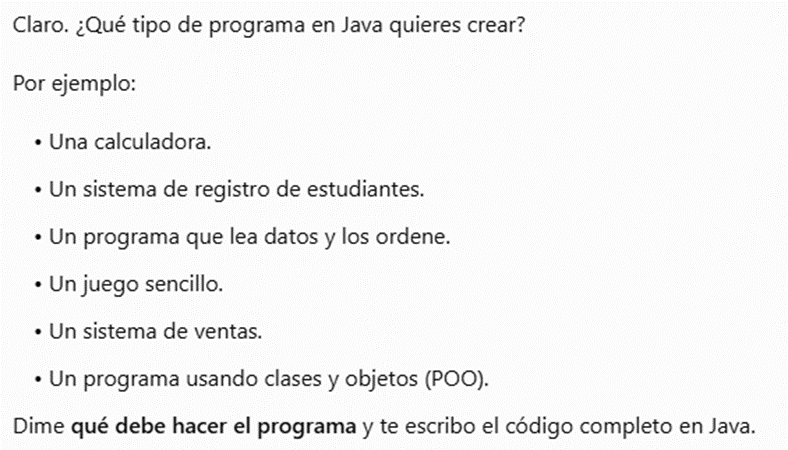
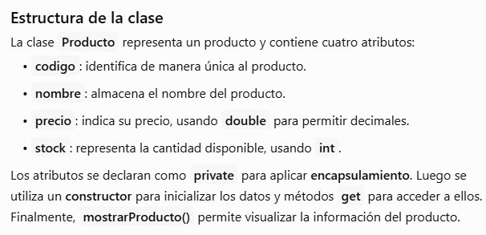

# Bitacora de prompts

Laboratorio 06: Fundamentos de Ingenieria de Prompts.

Herramienta de IA usada: ChatGPT

## Ejercicio 2: Tokens y ventana de contexto

| Texto | Caracteres | Tokens |
|---|---:|---:|
| Los estudiantes programan en Java. | 34 | 7 |
| The students program in Java. | 29 | 6 |
| desafortunadamente | 18 | 4 |

## Ejercicio 3: Temperatura

| Temperatura | % de BiblioTec | Nombres en los 5 intentos |
|---|---:|---|
| 0 | 100.0% | BiblioTec, BiblioTec, BiblioTec, BiblioTec, BiblioTec |
| 0.5 | 65.3% | BiblioTec, LibroYa, BiblioTec, BiblioTec, BiblioTec |
| 1 | 44.5% | LibroYa, LibroYa, BiblioTec, LectoGo, PaginaLibre |
| 1.8 | 32.2% | LectoGo, BiblioTec, LibroYa, LectoGo, LibroYa |

## Ejercicio 4: Prompt vago vs estructurado

| Criterio | Prompt vago | Prompt estructurado |
|---|---|---|
| Menciona el objetivo del sistema | Sí | Sí |
| Menciona a los usuarios principales | No | Sí |
| Tiene exactamente 3 funcionalidades | No | Sí |
| Está en 3 párrafos | No | Sí |
| Lo usaría en un informe real | No | Sí |

## Ejercicio 5: Anatomia de un prompt

| Componente | Texto de mi prompt |
|---|---|
| Rol | Actua como desarrollador Java. |
| Instruccion | Crea un programa en Java usando una clase Producto con los atributos codigo, nombre, precio y stock. |
| Contexto | Para gestionar los productos de una tienda. |
| Ejemplo | Usa este estilo para los metodos: getPrecio(), setPrecio(double precio). |
| Formato | Explica primero la estructura de la clase y luego presenta el codigo Java. |

Nivel 1: La respuesta fue general porque no tenia muchos detalles.

Nivel 2: Al agregar el rol, la respuesta se enfoco mas en Java.

Nivel 3: Con el contexto, el programa se enfoco en una tienda.

Nivel 4: Con la instruccion, se creo la clase Producto con los atributos solicitados.

Nivel 5: Con el formato, primero explico la estructura y luego mostro el codigo.

public class Producto {

    // Atributos
    private String codigo;
    private String nombre;
    private double precio;
    private int stock;

    // Constructor
    public Producto(String codigo, String nombre, double precio, int stock) {
        this.codigo = codigo;
        this.nombre = nombre;
        this.precio = precio;
        this.stock = stock;
    }

    // Métodos getters
    public String getCodigo() {
        return codigo;
    }

    public String getNombre() {
        return nombre;
    }

    public double getPrecio() {
        return precio;
    }

    public int getStock() {
        return stock;
    }

    // Método para mostrar los datos
    public void mostrarProducto() {
        System.out.println("Código: " + codigo);
        System.out.println("Nombre: " + nombre);
        System.out.println("Precio: S/ " + precio);
        System.out.println("Stock: " + stock);
    }
}

## Ejercicio 6: Del prompt basico al profesional

| Qué revisar | Cumple |
|---|---|
| ¿Está escrito en Java y usa Swing? | Sí |
| ¿Pide correo y contraseña? | Sí |
| ¿Explica el funcionamiento antes o después del código? | Sí |
| ¿El código está organizado en clases? | Sí |
| ¿Valida los datos que ingresa el usuario? | No |

- [Bitacora de prompts](prompts/BITACORA.md)
- [Tarea: mi prompt profesional](prompts/TAREA.md)